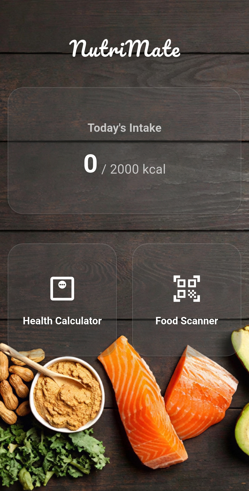
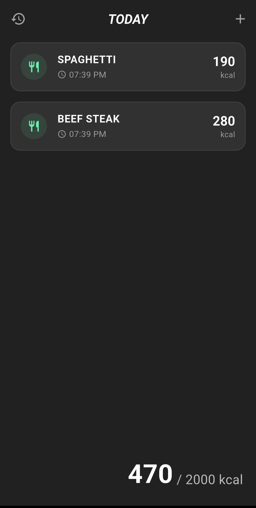
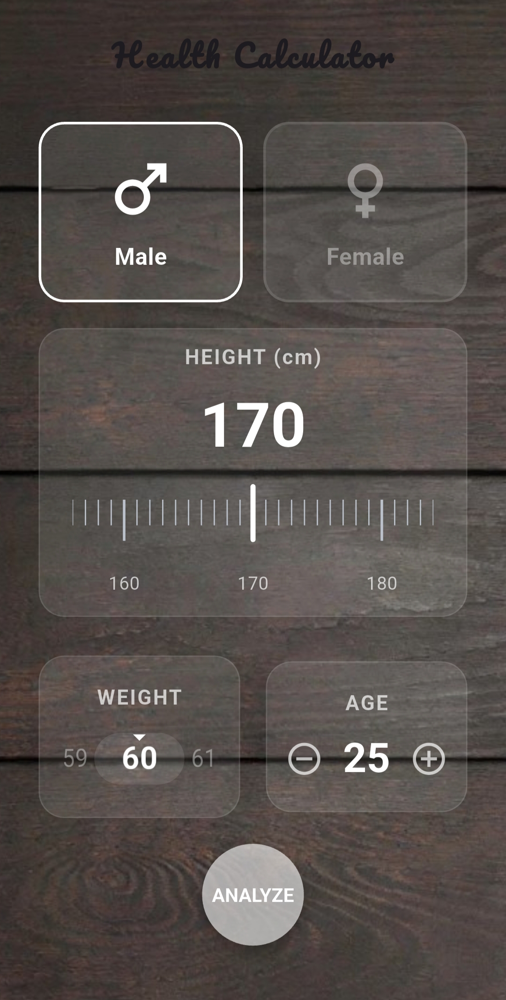
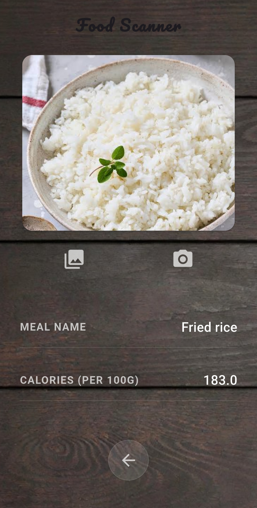

# NutriMate 🥗

NutriMate is a modern, feature-rich health and nutrition companion designed to help users monitor their physical well-being. From calculating vital health metrics to tracking daily calorie intake with an AI-powered scanner, NutriMate provides a complete toolkit for a healthier lifestyle.

## ✨ Features

- **AI Food Scanner**: Identify food items instantly using the built-in camera. This feature utilizes a **custom-trained machine learning model** to recognize various food types accurately.
- **Smart Calorie Retrieval**: Once a food item is identified, the app automatically fetches real-time nutritional data (calories) via the **USDA FoodData Central API**.
- **Advanced Health Calculators**: 
    - **BMI Calculator**: Real-time Body Mass Index calculation with animated visual feedback.
    - **BMR & TDEE**: Accurate Basal Metabolic Rate and Total Daily Energy Expenditure estimations based on user activity levels.
- **Daily Calorie Tracker**: Log your meals (Breakfast, Lunch, Dinner, Snacks) and track your total calorie consumption against your daily goals.
- **Interactive Progress**: Circular progress indicators and dynamic "Hero" text highlight your daily nutritional status.
- **History Tracking**: Automatically saves your daily calorie logs to a local database for long-term progress review.
- **Premium UI/UX**: 
    - **Custom Transitions**: Seamless page navigation using custom Fade and Slide transitions.
    - **Informative Tooltips**: Tap-to-reveal explanations for complex health metrics like BMR and TDEE.
    - **Dark Theme**: A sleek, high-contrast dark design for comfortable use at any time of day.

|                        Home Screen                        | Daily Tracker Screen |
|:---------------------------------------------------------:| :---: |
|              |  |
|               **Health Calculator Screen**                | **Food Scanner Screen** |
|  |  |

## 🛠️ Technologies Used

- **Framework**: [Flutter](https://flutter.dev/)
- **State Management**: [Flutter Riverpod](https://riverpod.dev/) for reactive and scalable state.
- **Machine Learning**: [Google ML Kit](https://developers.google.com/ml-kit) integrated with a **Custom-Made ML Model** for food recognition.
- **API Integration**: [USDA FoodData Central API](https://fdc.nal.usda.gov/api-guide.html) for fetching real-time nutritional information via `http`.
- **Database**: [sqflite](https://pub.dev/packages/sqflite) for local data persistence.
- **Local Storage**: `shared_preferences` for managing user goals and settings.
- **Animations**: Custom `AnimationController` implementations for smooth, interactive UI elements.
- **Image Handling**: [image_picker](https://pub.dev/packages/image_picker) for scanner input.

## 🚀 Getting Started

To get a local copy up and running, follow these simple steps.

### Prerequisites

Make sure you have Flutter installed on your machine.
- [Flutter Installation Guide](https://docs.flutter.dev/get-started/install)

### Installation

1. Clone the repo:
   ```sh
   git clone https://github.com/YouseefSaeed1/NutriMate.git
   ```
2. Navigate to the project directory:
   ```sh
   cd nutrimate
   ```
3. Install dependencies:
   ```sh
   flutter pub get
   ```
4. Generate the app launcher icons:
   ```sh
   flutter pub run flutter_launcher_icons
   ```
5. Run the app:
   ```sh
   flutter run
   ```
